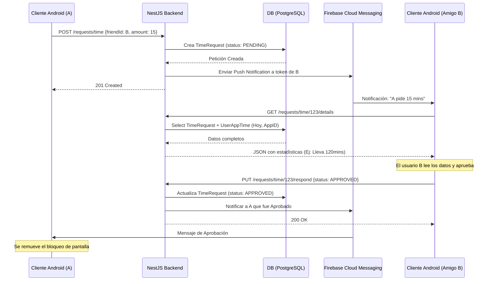

# Arquitectura del Sistema y Flujo de Mensajes - Truce

Este documento describe la arquitectura técnica detrás del backend de Truce y los flujos de comunicación principales entre la aplicación cliente (Android) y el servidor (NestJS).

## Arquitectura de Alto Nivel

El sistema se compone de las siguientes piezas principales:

1. **Cliente (App Android):** Interfaz gráfica e interceptor de eventos del sistema (Accessibility Service / Usage Stats) para bloquear apps y medir el tiempo.
2. **Backend (NestJS API REST):** Servidor centralizado. Expone los endpoints seguros para guardar datos, gestionar amigos y solicitar tiempo.
3. **Base de Datos (PostgreSQL):** Almacena perfiles, amistades, tiempos de uso y peticiones. Accedida a través de Prisma ORM.
4. **Supabase Auth:** Proveedor de identidad externo. Gestiona el registro, login y emisión de JWTs.
5. **Firebase Cloud Messaging (FCM):** Servicio puente para enviar notificaciones Push (mensajes) en tiempo real desde el Backend hacia el Cliente Android.

## Flujo de Autenticación y Autorización

1. La app Android autentica al usuario usando **Supabase Auth** (ej. Login con Google o Email/Password).
2. Supabase devuelve un **JWT (JSON Web Token)** seguro al cliente.
3. El cliente Android envía todas las peticiones a la API REST de NestJS incluyendo el header: `Authorization: Bearer <JWT>`.
4. El `AuthModule` de NestJS, mediante PassportJS y un `JwtStrategy`, verifica la firma del token con las llaves de Supabase. Si es válido, inyecta el `usuario` en el objeto Request para que los controladores sepan quién hace la llamada.

---

## Flujos de Mensajes y Operaciones Principales

Dado que una API REST es síncrona e iniciada por el cliente, **la comunicación asíncrona hacia el usuario (notificaciones y "mensajes" entre usuarios) se logra integrando FCM en el backend**.

### 1. Sincronización de Estadísticas de Uso (App Usage)
El cliente Android monitorea el tiempo en segundo plano y lo reporta al backend periódicamente.

- **Trigger:** Tarea en background (WorkManager) en Android (ej. cada 15 min).
- **Flujo:**
  1. Cliente `POST /stats/sync` enviando un array con el paquete de la app y el tiempo invertido en minutos.
  2. Backend recibe el payload, verifica el usuario autenticado.
  3. Backend busca o crea el registro en `UserAppTime` para la fecha de hoy e incrementa/actualiza el `timeSpent`.
  4. Responde `200 OK` al cliente.

### 2. Solicitud de Amistad (Friend Request)
Un usuario quiere agregar a un amigo para compartir controles de límite de tiempo.

- **Trigger:** El usuario A busca el `username` del usuario B y toca "Añadir".
- **Flujo:**
  1. Cliente A -> `POST /friends/request` con `{ "receiverUsername": "juan123" }`.
  2. Backend valida la existencia de `juan123` y crea un registro en `Friendship` con `status = 'PENDING'`.
  3. Backend recupera el `fcmToken` del usuario B.
  4. Backend dispara una notificación push vía FCM a B: *"El usuario A te ha enviado una solicitud de amistad"*.
  5. Cliente B recibe la notificación push. Al abrir la app, hace `GET /friends/requests/pending` para ver y aceptar/rechazar.

### 3. Petición de Tiempo Extra (Time Request)
El usuario A agota el tiempo de una app y necesita autorización de su amigo B para seguir usándola.

- **Trigger:** La app se bloquea en Android. El usuario A toca "Pedir tiempo a un amigo", selecciona al amigo B y elige "15 minutos".
- **Flujo:**
  1. Cliente A -> `POST /requests/time` con `{ "friendId": "B_ID", "amount": 15, "appId": "APP_ID", "message": "¡Estoy terminando una tarea!" }`.
  2. Backend crea un registro en `TimeRequest` con `status = 'PENDING'`.
  3. Backend obtiene el `fcmToken` del usuario B y dispara un mensaje FCM de alta prioridad (Data Message).
  4. Cliente B recibe la alerta en tiempo real en su celular.

### 4. Revisión de Estadísticas y Aprobación/Rechazo de Tiempo
El amigo B recibe la petición de tiempo y necesita saber si A realmente lo necesita o si ha estado todo el día en el celular.

- **Trigger:** El usuario B abre la notificación de petición de tiempo.
- **Flujo:**
  1. Cliente B -> `GET /requests/time/:requestId/details`.
  2. Backend busca la `TimeRequest`. Alimenta la respuesta con datos adicionales: busca en `UserAppTime` cuánto tiempo ha usado A la app en cuestión hoy (ej. `timeSpent: 120 min`, `dailyLimit: 60 min`).
  3. Backend devuelve un JSON detallado con el tiempo de uso actual y el mensaje.
  4. Cliente B muestra una UI indicando: *"Tu amigo ha usado esta app por 120 min. Límite era 60 min. Quiere 15 min más."*
  5. Cliente B elige Aceptar o Rechazar y envía: `PUT /requests/time/:requestId/respond` con `{ "status": "APPROVED" }`.
  6. Backend actualiza la solicitud a `APPROVED`.
  7. Backend (opcionalmente) envía notificación FCM de vuelta al usuario A indicando que su tiempo fue aprobado.
  8. (El Cliente A, al ser notificado o al reintentar, desbloquea la app localmente por 15 minutos).

---

## Diagrama de Secuencia: Petición de Tiempo

