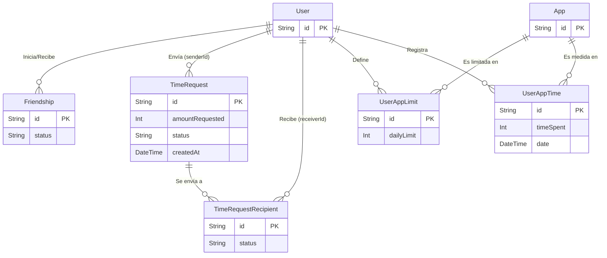

# Modelo de Datos - Truce Backend

El modelo de datos de Truce está diseñado para soportar eficientemente las relaciones de amistad, el registro del tiempo de uso diario, los límites de tiempo configurados y el sistema de peticiones de tiempo. Utilizamos **PostgreSQL** administrado a través de **Prisma ORM**.

A continuación se detalla la estructura y propósito de cada entidad del sistema:

## Entidades Principales

### 1. User (Usuario)
Representa a los usuarios de la aplicación. La autenticación real está delegada a Supabase, por lo que esta tabla almacena los datos de perfil y la información necesaria para notificaciones.

- `id`: UUID único (suele coincidir o mapearse con el ID del usuario en Supabase).
- `email`: Correo electrónico (único).
- `username`: Nombre de usuario visible para otros (único).
- `fcmToken`: Token de Firebase Cloud Messaging.
- `createdAt` / `updatedAt`: Fechas de auditoría.

*Relaciones:* Relaciones uno-a-muchos con las amistades, límites de apps, estadísticas, solicitudes enviadas (hacia `TimeRequest`) y solicitudes recibidas (hacia `TimeRequestRecipient`).

### 2. Friendship (Amistad / Solicitud de Amistad)
Maneja el grafo social de la aplicación.

- `id`: UUID.
- `userId1`: Referencia al usuario que inicia la solicitud.
- `userId2`: Referencia al usuario que recibe la solicitud.
- `status`: `PENDING`, `ACCEPTED`, `REJECTED`.
- `createdAt` / `updatedAt`: Fechas de registro y última actualización.

> **Nota:** Existe una restricción única (`@@unique([userId1, userId2])`).

### 3. TimeRequest (Solicitud de Tiempo Extra - Emisor)
Registra el evento lógico de una petición de tiempo. Esto permite que un usuario pueda pedir tiempo a múltiples amigos a la vez (por ejemplo, "a un subconjunto" o "a todos sus amigos").

- `id`: UUID.
- `senderId`: ID del usuario que se quedó sin tiempo.
- `amountRequested`: Cantidad de tiempo solicitada (en minutos).
- `message`: Mensaje opcional enviado por el solicitante.
- `status`: Estado general de la petición (`PENDING`, `APPROVED`, `DENIED`).
- `createdAt`: Fecha y hora exacta de la solicitud.
- `updatedAt`: Fecha y hora de última modificación.

### 4. TimeRequestRecipient (Destinatario de Solicitud de Tiempo)
Registra la relación individual entre una solicitud de tiempo general (`TimeRequest`) y cada uno de los amigos que la reciben, permitiéndoles responder de forma independiente.

- `id`: UUID.
- `timeRequestId`: Referencia a la petición central.
- `receiverId`: ID del amigo al que se le solicita.
- `status`: Estado de la respuesta de este amigo (`PENDING`, `APPROVED`, `DENIED`).
- `createdAt` / `updatedAt`: Fechas de registro.

> **Regla de negocio:** Cuando un `TimeRequestRecipient` cambia a `APPROVED`, el backend puede actualizar automáticamente el `status` del `TimeRequest` padre a `APPROVED`.

### 5. App (Aplicación)
Catálogo global de las aplicaciones instaladas.

- `id`: UUID.
- `packageName`: Identificador único de la aplicación (ej. `com.whatsapp`).
- `name`: Nombre legible de la aplicación.

### 6. UserAppLimit (Límites de Aplicaciones)
Almacena el límite de tiempo configurado por un usuario para una aplicación determinada.

- `id`: UUID.
- `userId`: Referencia al usuario.
- `appId`: Referencia a la aplicación.
- `dailyLimit`: Límite máximo de tiempo diario permitido.

### 7. UserAppTime (Tiempo de Uso Diario)
Registra el tiempo que un usuario ha gastado efectivamente en una aplicación durante un día específico.

- `id`: UUID.
- `userId`: Referencia al usuario.
- `appId`: Referencia a la aplicación.
- `timeSpent`: Tiempo total utilizado en el día (en minutos).
- `date`: Fecha del registro (sin la hora, para agrupar estadísticas por día).

## Diagrama de Relaciones Conceptual

