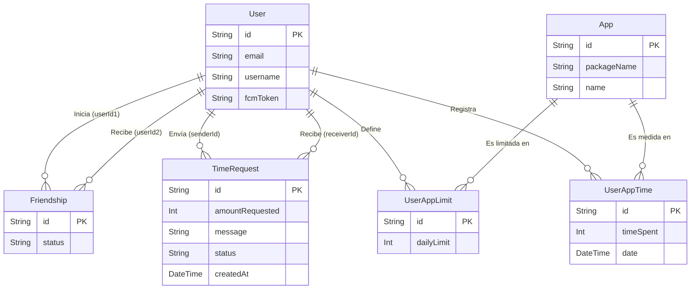

# Modelo de Datos - Truce Backend

El modelo de datos de Truce está diseñado para soportar eficientemente las relaciones de amistad, el registro del tiempo de uso diario, los límites de tiempo configurados y el sistema de peticiones de tiempo. Utilizamos **PostgreSQL** administrado a través de **Prisma ORM**.

A continuación se detalla la estructura y propósito de cada entidad del sistema:

## Entidades Principales

### 1. User (Usuario)
Representa a los usuarios de la aplicación. La autenticación real está delegada a Supabase, por lo que esta tabla almacena los datos de perfil y la información necesaria para notificaciones.

- `id`: UUID único (suele coincidir o mapearse con el ID del usuario en Supabase).
- `email`: Correo electrónico (único).
- `username`: Nombre de usuario visible para otros (único).
- `fcmToken`: Token de Firebase Cloud Messaging. Es vital para poder enviarle notificaciones push cuando recibe solicitudes de amistad o peticiones de tiempo.
- `createdAt` / `updatedAt`: Fechas de auditoría.

*Relaciones:* Posee relaciones uno-a-muchos con las solicitudes de tiempo enviadas y recibidas, las amistades (iniciadas y recibidas), los límites de aplicaciones configurados, y las estadísticas de tiempo consumido.

### 2. Friendship (Amistad / Solicitud de Amistad)
Maneja el grafo social de la aplicación. Sirve tanto para representar solicitudes de amistad pendientes como conexiones confirmadas.

- `id`: UUID.
- `userId1`: Referencia al usuario que inicia la solicitud.
- `userId2`: Referencia al usuario que recibe la solicitud.
- `status`: Estado actual de la relación. Valores posibles: `PENDING` (solicitud enviada), `ACCEPTED` (son amigos), `REJECTED` (solicitud rechazada).
- `createdAt` / `updatedAt`: Fechas de registro y última actualización.

> **Nota:** Existe una restricción única (`@@unique([userId1, userId2])`) para evitar que dos usuarios tengan múltiples registros de amistad simultáneos.

### 3. TimeRequest (Solicitud de Tiempo Extra)
Registra las peticiones (peer pressure) que un usuario hace a un amigo cuando agota su límite de tiempo en pantalla.

- `id`: UUID.
- `senderId`: ID del usuario que se quedó sin tiempo y pide más.
- `receiverId`: ID del amigo al que se le solicita el tiempo.
- `amountRequested`: Cantidad de tiempo solicitada (en minutos).
- `message`: Mensaje opcional enviado por el solicitante (ej. "¡Porfa, estoy en medio de una partida!").
- `status`: Estado de la petición. Valores: `PENDING`, `APPROVED`, `DENIED`.
- `createdAt`: Fecha y hora exactas en la que se realizó la solicitud (generado automáticamente al insertar la fila, permitiendo mostrar cuándo ocurrió en el historial del cliente Android).
- `updatedAt`: Fecha y hora de resolución de la solicitud.

### 4. App (Aplicación)
Catálogo global de las aplicaciones instaladas en los dispositivos para evitar duplicación de texto y estandarizar los datos.

- `id`: UUID.
- `packageName`: Identificador único de la aplicación (ej. `com.whatsapp`, `com.instagram.android`).
- `name`: Nombre legible de la aplicación ("WhatsApp", "Instagram").

### 5. UserAppLimit (Límites de Aplicaciones)
Almacena el límite de tiempo configurado por un usuario para una aplicación determinada.

- `id`: UUID.
- `userId`: Referencia al usuario.
- `appId`: Referencia a la aplicación.
- `dailyLimit`: Límite máximo de tiempo diario permitido para esa app (en minutos).

> **Nota:** La restricción `@@unique([userId, appId])` asegura que solo exista un límite activo configurado por usuario por aplicación.

### 6. UserAppTime (Tiempo de Uso Diario)
Registra el tiempo que un usuario ha gastado efectivamente en una aplicación durante un día específico. Cada fila representa un día de uso.

- `id`: UUID.
- `userId`: Referencia al usuario.
- `appId`: Referencia a la aplicación.
- `timeSpent`: Tiempo total utilizado en el día (en minutos). Este valor se actualiza periódicamente desde el cliente Android.
- `date`: Fecha correspondiente al registro (sin la hora, para agrupar estadísticas por día).

> **Nota:** La combinación de usuario, app y fecha es única (`@@unique([userId, appId, date])`), de modo que no se duplican registros por día.

## Diagrama de Relaciones Conceptual

